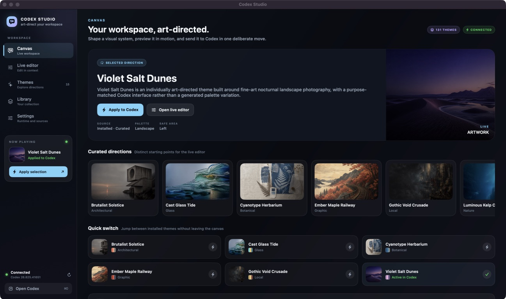
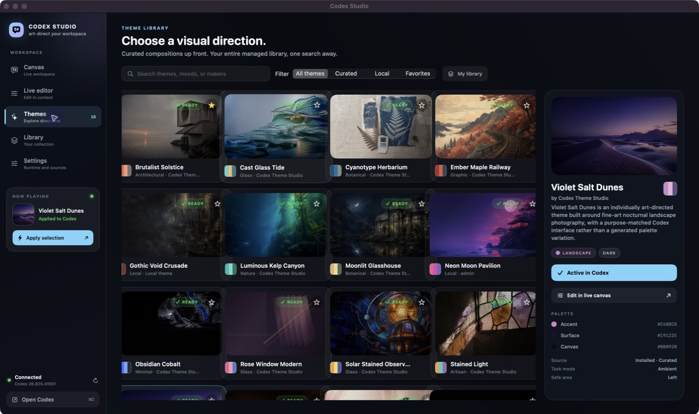
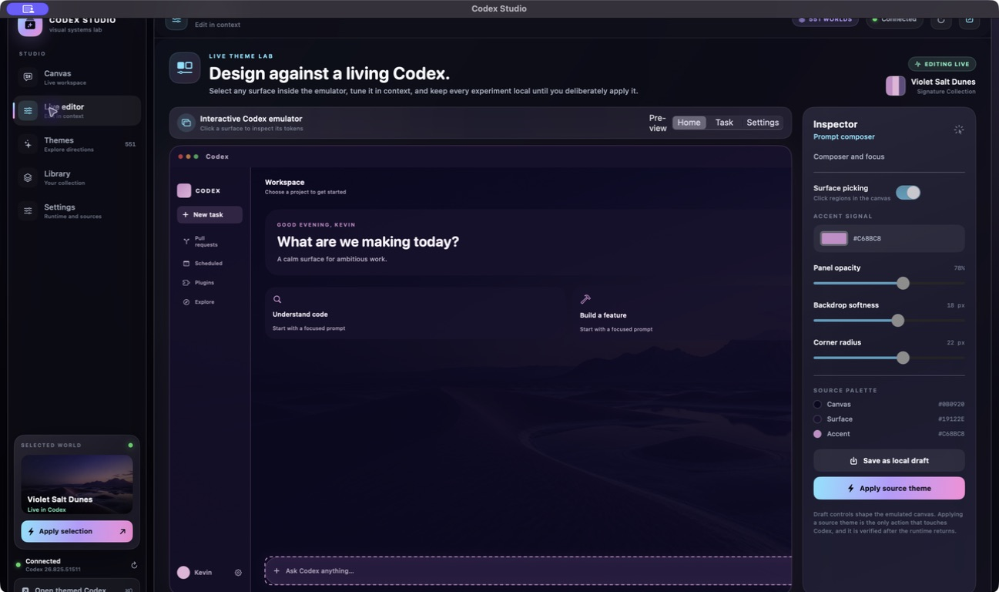

<p align="center">
  
</p>

# Codex Studio

Codex Studio is a standalone native macOS theme studio for Codex. It is intentionally a fresh implementation rather than a fork of the previous Codex Themes desktop UI.

The app icon is an original Codex Studio asset generated for this project and stored as `Resources/CodexStudioIcon.png` with the bundled macOS representation in `Resources/CodexStudio.icns`. The separate DockDoor helper uses the stock Codex dark-mode icon from `Resources/CodexDark.icns`, so its shortcut reads as Codex while remaining visibly distinct from the Codex Studio app.

Codex Studio also includes Sparkle 2.9.6 for signed, GitHub-hosted updates. Use **Codex Studio > Check for Updates…** after installing a release build. The Sparkle private signing key is never stored in this repository; only the public verification key belongs in the app bundle.

Codex Studio follows a provenance-first theme policy. New bundled artwork must be human-created and traceable to a rights-cleared source. AI-generated imagery and procedurally mass-produced gallery filler are not accepted into the curated library. Palette extraction, cropping, and interface-token generation may be automated locally, but the artwork itself must retain its real creator, work title, source page, and rights status.

The bundled macOS Era shelf contains 23 official Apple release wallpapers, from Cheetah/Puma through Golden Gate, for personal use. The iOS and iPadOS shelves are populated from distinct still wallpapers preserved by the iOS-Wallpapers archive, plus the current Apple-hosted WWDC26 platform assets. Mobile artwork is deterministically center-cropped into 2400×1500 Mac canvases so it is never displayed as a cramped portrait card. These Apple shelves remain marked local-only with full provenance records and are included in the offline release bundle. Every bundled artwork entry must retain a source record and rights status.







Codex Studio is built around three ideas:

- a fast, explicit apply-and-verify path for switching themes;
- a large, bundled library of provenance-verified themes that remains immediately available on a clean Mac;
- a live, inspectable Codex canvas for shaping a theme before applying it.

The adaptive theme library uses a full-width spotlight, category rail, search, filters, and a responsive card grid. Its selected-theme details no longer occupy a fixed right column, so the gallery remains usable instead of being clipped at narrower window widths.

## Run

```bash
./script/build_and_run.sh
```

The same script is wired into the Codex app Run action through `.codex/environments/environment.toml`.

## Theme sources

Codex Studio installs bundled themes into and then reads the managed library at:

```text
~/Library/Application Support/CodexDreamSkinStudio/themes
```

The release app reads the source catalog in `Resources/ThemePacks`, but its default build gate copies only packages with a source URL, a `LICENSE.txt` record, `aiGenerated: false`, and Public Domain or CC0 rights. The offline Apple shelves are included only when `CODEX_STUDIO_INCLUDE_LOCAL_ONLY_THEMES=true` is explicitly set for a personal-use build. The signed app reads the verified catalog directly, so first launch does not duplicate hundreds of image files before the gallery appears. When a bundled theme is applied for the first time, Codex Studio copies only that package into the managed library using an atomic staging move. Existing local packages are preserved. New themes added to `Resources/ThemePacks` are included in a future build only after they pass the same provenance gate or an explicit local-only release override.

### Local build cache

The repository is stored in iCloud, but build-critical artwork and runtime inputs are mirrored locally at:

```text
~/Library/Application Support/CodexStudio/ThemePacks
~/Library/Application Support/CodexStudio/BuildAssets
```

Normal builds and release packaging assemble the app from these local mirrors, so previously downloaded themes do not need to be hydrated again. A new rights-cleared theme folder is synchronized once when it first appears in the source catalog. The official Apple shelves are imported into the same local mirror by `script/import_official_macos_wallpapers.sh` and `script/import_official_mobile_wallpapers.sh`; they are never downloaded during a normal build. The mobile importer deduplicates device-size copies, keeps the highest-resolution still per distinct artwork, and records the original archive path in each local-only provenance record. After intentionally changing an existing pack or runtime file, refresh the relevant mirror explicitly:

```bash
CODEX_STUDIO_REFRESH_THEME_CACHE=true CODEX_STUDIO_REFRESH_LOCAL_BUILD_ASSETS=true ./script/build_and_run.sh build
```

To refresh the personal-use Apple wallpaper shelves, run `CODEX_STUDIO_REFRESH_OFFICIAL_WALLPAPERS=true ./script/import_official_macos_wallpapers.sh` and `CODEX_STUDIO_REFRESH_OFFICIAL_MOBILE_WALLPAPERS=true ./script/import_official_mobile_wallpapers.sh` once. Debug builds include local-only packs by default; set `CODEX_STUDIO_INCLUDE_LOCAL_ONLY_THEMES=false` to test the release catalog.

Every newly curated package must include a `LICENSE.txt` file naming the artwork, creator, institution or publisher, source record URL, image URL, rights status, and retrieval date. A theme without verifiable redistribution rights may remain in a user's private imported library, but it is not eligible for a Codex Studio release bundle.

The release app also bundles the Codex theme runtime and installs it at first launch, upgrading an older managed runtime atomically when the bundled runtime version is newer:

```text
~/.codex/codex-dream-skin-studio/scripts/switch-theme-macos.sh
```

The app only reports success after the runtime state confirms the requested theme id. Existing runtime state is never overwritten by the bootstrapper. If Codex is not installed or the runtime cannot verify the live renderer, the UI says so.

For DockDoor Pro users, the same release bootstrap installs or upgrades a portable `Codex Themed.app` helper, displayed by macOS as `Codex Studio (Themed)` so it is distinguishable from the stock Codex pin. Launching that helper starts the official signed Codex app through the managed theme engine and keeps the helper alive while Codex is open, so DockDoor preserves the themed pin. The helper also repairs a missing per-user persistence monitor before launch, and if a Codex updater launches the stock app without the theme debug endpoint, it waits briefly and relaunches it through the verified engine.

Applying a theme also enables a per-user launch monitor. This covers the normal stock Codex Dock icon after `⌘Q`: the monitor detects an unthemed launch and restarts that same signed Codex bundle through the verified theme engine. Choosing **Restore original appearance** disables the monitor.

## Release artifacts

The release scripts create an Apple Silicon app bundle, signed ZIP, signed DMG, and Sparkle `appcast.xml`. Distribution builds require a Developer ID Application identity and an Apple notarytool credential profile on the build machine. The GitHub Actions workflow uses repository secrets for those credentials and never commits them.

## Project shape

```text
Sources/CodexStudio/
├── App/          app entry point and activation
├── Models/       theme, section, and runtime models
├── Stores/       app state and user actions
├── Services/     theme discovery, import, and Codex runtime bridge
├── Support/     colors, styles, and image artwork
└── Views/        sidebar, canvas, library, editor, and settings
```

Codex Studio is not an OpenAI product and does not modify the official Codex app bundle, `app.asar`, or its code signature.

The implementation in this repository is new code and does not copy the previous Codex Themes application. The bundled theme packages and runtime are vendored release inputs with provenance and licensing notes in [ATTRIBUTIONS.md](ATTRIBUTIONS.md), and package-level metadata must remain intact when themes are added or redistributed.

See [ATTRIBUTIONS.md](ATTRIBUTIONS.md) for the project provenance and third-party notice policy.

See [CURATION_POLICY.md](CURATION_POLICY.md) for the non-AI artwork and release-eligibility rules applied to every newly curated theme.
